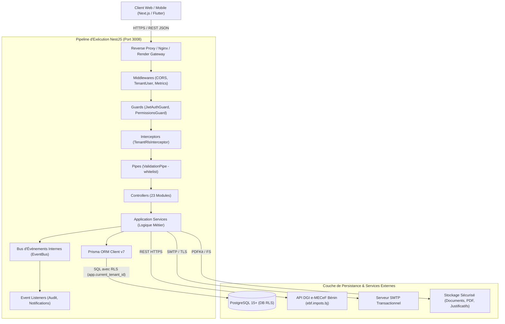
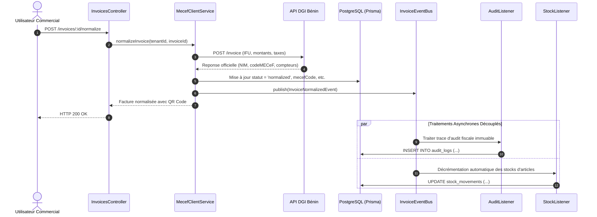

# Architecture Technique — Backend Nexera ERP

---

## 1. Vue d'Ensemble & Principes Directeurs

Le backend de **Nexera ERP** est développé avec le framework **NestJS v11** sur un socle **TypeScript** strict en environnement **Node.js** (LTS v20+). Il repose sur les principes de la *Clean Architecture* et du *Domain-Driven Design (DDD)* adaptés aux progiciels de gestion intégrés d'entreprise.

### Piliers d'Architecture :
1. **Modularité Découplée** : Chaque domaine fonctionnel (Facturation, RH, Notes de frais, Fiscalité) est encapsulé dans un module NestJS autonome disposant de ses propres contrôleurs, services, DTOs et entités.
2. **Isolation Multi-Tenant Native par RLS** : Sécurisation absolue des données au niveau du moteur de base de données PostgreSQL via **Row Level Security (RLS)**, éliminant tout risque de fuite inter-entreprises.
3. **Architecture Orientée Événements (Event-Driven)** : Utilisation d'un bus d'événements interne pour découpler les opérations synchrones critiques (émission d'une facture) des traitements asynchrones (audit, métriques, notifications).
4. **Typage Fort & Validation Stricte** : Typage TypeScript de bout en bout et validation automatique à l'exécution par `class-validator` et `class-transformer`.

---

## 2. Diagramme d'Architecture Globale



---

## 3. Le Pipeline d'Exécution d'une Requête HTTP

Toute requête entrante traverse une séquence rigoureuse d'étapes ordonnées :

```
[Requête Entrante]
       │
       ▼
1. Middlewares Globaux
   ├── CORS Middleware : Contrôle des origines autorisées
   ├── MetricsMiddleware : Mesure des temps de réponse et compteurs HTTP Prometheus
   └── TenantUserMiddleware : Extraction du contexte multi-tenant
       │
       ▼
2. Guards d'Authentification & d'Autorisation
   ├── JwtAuthGuard : Vérification cryptographique du Bearer Token (public si @Public())
   └── PermissionsGuard : Validation des permissions requises (@Permissions('...'))
       │
       ▼
3. Intercepteurs de Sécurité
   └── TenantRlsInterceptor : Injection de la variable de session PostgreSQL (app.current_tenant_id)
       │
       ▼
4. Validation Pipes
   └── ValidationPipe : Validation DTO stricte (rejet automatique des champs non déclarés)
       │
       ▼
5. Contrôleur de Domaine
   └── Dispatch vers le Service Métier correspondant
       │
       ▼
6. Couche Service Métier
   └── Traitement métier, validation des règles de gestion, émission d'événements
       │
       ▼
7. Couche d'Accès aux Données (Prisma ORM)
   └── Exécution des requêtes SQL cloisonnées par RLS
       │
       ▼
[Réponse JSON Standardisée HTTP 200/201/204]
```

---

## 4. Mécanisme d'Isolation Multi-Tenant (PostgreSQL RLS)

### 4.1 Le Défi
Dans une architecture SaaS partagée (*shared-database, shared-schema*), le risque majeur réside dans l'oubli accidentel d'une clause `WHERE tenant_id = '...'` dans une requête complexe, exposant potentiellement les données financières d'une entreprise à une autre.

### 4.2 La Solution Nexera
Nexera utilise la technologie native de PostgreSQL : **Row Level Security (RLS)**.

1. **Extraction de Contexte** :
   Le middleware `TenantUserMiddleware` extrait le `tenantId` à partir du jeton JWT décodé ou de l'en-tête `X-Tenant-Id`.
2. **Activation de Session PostgreSQL** :
   L'intercepteur `TenantRlsInterceptor` exécute au début de la requête la commande SQL :
   ```sql
   SET LOCAL app.current_tenant_id = '<ID_DU_TENANT_CONNECTE>';
   ```
3. **Filtrage Invisible et Garanti** :
   Toutes les tables sensibles (factures, paiements, salariés, écritures) sont protégées par une politique RLS PostgreSQL :
   ```sql
   CREATE POLICY tenant_isolation_policy ON invoices
   FOR ALL
   USING (tenant_id = NULLIF(current_setting('app.current_tenant_id', true), '')::text);
   ```
   Même si une requête Prisma omettait le filtre applicatif, la base de données ne renverra strictement que les lignes appartenant au tenant actif.

---

## 5. Bus d'Événements & Découplage Asynchrone

Pour préserver des temps de réponse ultra-rapides (< 100 ms) sur les actions utilisateur critiques, les traitements secondaires sont délégués au bus d'événements interne (`IntegrationEventsModule`) :

### Exemple : Cycle de Normalisation d'une Facture


---

## 6. Moteur de Génération de Documents PDF & QR Code

Les pièces commerciales, bulletins de paie et attestations sont générés directement en code vectoriel sans dépendre d'un navigateur headless lourd (type Puppeteer), garantissant une empreinte mémoire minimale (< 30 Mo) et une vitesse d'exécution fulgurante (< 400 ms par document) :

- **PDFKit v0.18** : Moteur de tracé vectoriel au pixel près avec gestion des polices intégrées, sauts de page automatiques et tableaux dynamiques.
- **QRCode v1.5** : Moteur de calcul matriciel pour la génération du QR Code certifié DGI intégré directement dans le flux binaire PDF.
- **Système de Cache d'Invalidation** : Les flux PDF générés sont mis en cache. Toute modification ou normalisation fiscale invalide immédiatement le cache pour forcer la régénération avec le sceau officiel DGI.
