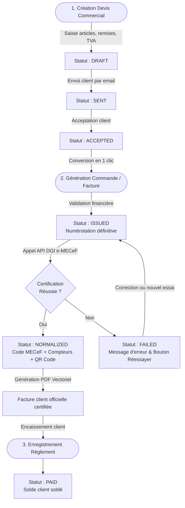

# Guide des Processus Métiers & Workflows — Backend Nexera ERP

---

## 1. Processus 01 : Cycle Commercial & Facturation Certifiée e-MECeF

Ce processus décrit le cheminement standard d'une vente de biens ou services, de la négociation initiale à l'encaissement et à la régularisation fiscale auprès de la DGI Bénin :



### Règles de Gestion Incontournables :
- Une facture au statut `draft` ne porte **jamais** de numéro définitif et ne peut **jamais** être normalisée.
- Une facture émise (`issued`) ne peut plus être supprimée ni altérée.
- La certification e-MECeF génère un code cryptographique unique rattaché à l'entreprise émettrice et au client.

---

## 2. Processus 02 : Facture d'Avoir & Rectification Fiscale

Lorsqu'une facture doit être annulée (retour de marchandise, erreur de facturation ou geste commercial), la loi fiscale interdit la suppression simple du document. La procédure légale impose l'émission d'un **Avoir normalisé (Type FA)** :

1. **Sélection de la Facture d'Origine** :
   Dans la fiche de la facture concernée, déclenchez l'action *« Créer un avoir »*.
2. **Liaison Obligatoire du Code MECeF** :
   Le système copie automatiquement le code MECeF officiel de la facture initiale dans le champ `originalMecefCode`.
3. **Émission de l'Avoir** :
   Attribution d'un numéro d'avoir séquentiel distinct (ex. `AVOIR-202609-0005`).
4. **Certification Fiscale (Type FA)** :
   Le backend transmet à la DGI le type de document `FA` ainsi que la référence au code d'origine.
5. **Imputation Comptable** :
   L'avoir vient diminuer la dette du client ou donne lieu à un remboursement de trop-perçu.

---

## 3. Processus 03 : Cycle Mensuel de Paie OHADA / Bénin

Le traitement des salaires s'exécute selon une séquence mensuelle rigoureuse :

```
[Étape 1 : Préparation de la Période]
  ├── Ouverture de la période mensuelle (ex. Septembre 2026)
  └── Import des éléments variables (heures sup, primes exceptionnelles, acomptes perçus)
       │
       ▼
[Étape 2 : Moteur de Calcul Automatisé]
  ├── Calcul du Salaire Brut Total (Base + Primes)
  ├── Déduction des Cotisations CNSS Ouvrières (3.6%)
  ├── Détermination du Salaire Net Imposable
  ├── Application du barème progressif IPTS/IRPP avec abattement charges de famille
  ├── Calcul des Charges Patronales (CNSS 14.4% + VPS 4%)
  └── Détermination du Salaire Net à Payer
       │
       ▼
[Étape 3 : Contrôle & Validation]
  ├── Édition de l'état récapitulatif (Livre de Paie)
  └── Contrôle des anomalies par le DRH / Comptable
       │
       ▼
[Étape 4 : Clôture & Distribution]
  ├── Clôture irréversible de la période (verrouillage des bulletins)
  ├── Génération en masse des bulletins de paie PDF conformes OHADA
  └── Préparation de la déclaration mensuelle récapitulative CNSS / IPTS
```

---

## 4. Processus 04 : Traitement des Notes de Frais Professionnelles

Le workflow de remboursement des dépenses engagées par les collaborateurs repose sur une double gouvernance :

1. **Saisie & Justificatif** :
   Le collaborateur saisit sa note de frais sur mobile ou web, renseigne la catégorie (déplacement, repas, hôtel), saisit la TVA et téléverse la photo du reçu.
2. **Validation Hiérarchique (N+1)** :
   Le manager examine la légitimité opérationnelle de la dépense. Il peut l'approuver ou la rejeter avec motif obligatoire.
3. **Approbation Comptable (N+2)** :
   Le service comptable contrôle la validité fiscale de la pièce justificative et confirme l'éligibilité à la déduction de TVA.
4. **Remboursement & Écriture** :
   Ordonnancement du virement bancaire et génération automatique de l'écriture de dépense en comptabilité.

---

## 5. Processus 05 : Clôture Fiscale & Export du Fichier FEC (Arrêté 1085-C)

En fin d'exercice fiscal ou lors d'un contrôle de la Direction Générale des Impôts, la production du Fichier des Écritures Comptables dématérialisé s'effectue en 4 phases :

1. **Vérification Préalable de Cohérence** :
   Exécution du diagnostic `/api/fiscalite/fec/controle` détectant les écritures non équilibrées, les pièces sans référence ou les dates hors exercice.
2. **Lettrage & Clôture Définitive** :
   Validation du lettrage des comptes de tiers et confirmation de la clôture des journaux comptables.
3. **Extraction & Formatage Normalisé** :
   Génération du fichier texte tabulé respectant scrupuleusement l'ordre des **18 colonnes** imposées par l'Arrêté 1085-C.
4. **Scellement Cryptographique SHA-256** :
   Calcul et consignation de l'empreinte numérique inviolable du fichier FEC, garantissant aux inspecteurs qu'aucune ligne n'a été altérée a posteriori.
