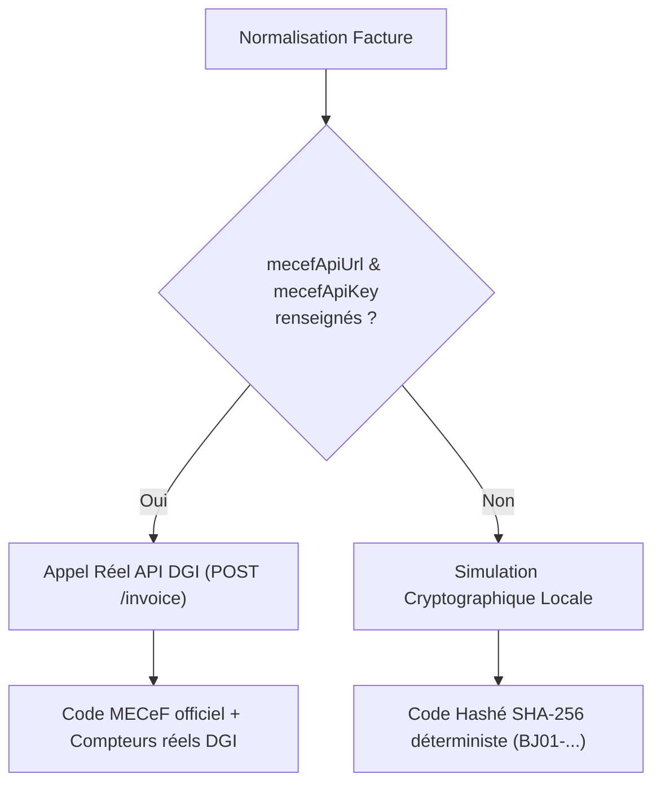

# ADR-003 : Intégration Hybride (API & Simulation) e-MECeF DGI Bénin

## Statut
**Accepté**

## Contexte
La législation fiscale de la République du Bénin impose la normalisation des factures professionnelles auprès de la plateforme e-MECeF de la Direction Générale des Impôts (DGI).
Cependant, les environnements de développement local, les pipelines de tests continus (CI) et les phases de démonstration ne peuvent pas solliciter le serveur de production de la DGI sous peine de polluer le registre fiscal étatique ou d'échouer lors de coupures réseau externes.

## Décision
Nous avons conçu une architecture **Hybride à Deux Voies** dans `MecefClientService` :

1. **Mode Production Réel** : Activé dès que l'URL (`mecefApiUrl`) et le jeton d'authentification (`mecefApiKey`) sont configurés sur le tenant. Réalise un appel HTTP sécurisé avec un timeout strict de 10 secondes (`AbortController`).
2. **Mode Simulation Sandbox Déterministe** : Exécuté en l'absence de clés ou en environnement de test. Génère un hash SHA-256 formaté en blocs `BJ01-XXXX-XXXX-XXXX-XXXX` et des compteurs séquentiels locaux, reproduisant fidèlement le comportement de la DGI pour les tests et le rendu du QR Code.

## Conséquences
### Positives :
- Les développeurs et les suites de tests CI peuvent tester l'intégralité du cycle de facturation sans dépendance réseau externe.
- Le passage en production s'effectue sans aucune recompilation ni modification de code, par simple mise à jour des paramètres du tenant (`PATCH /api/invoices/mecef/config`).
### Négatives & Atténuations :
- Le simulateur local doit rester parfaitement synchronisé avec les évolutions du format de payload de la DGI Bénin.
