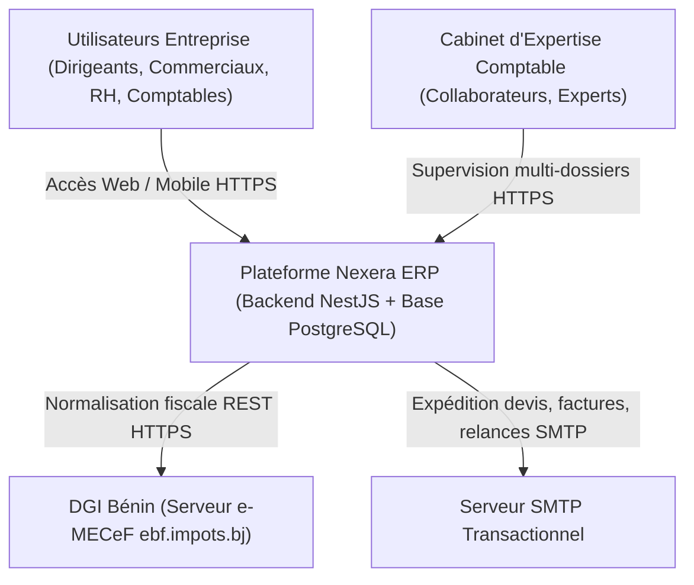
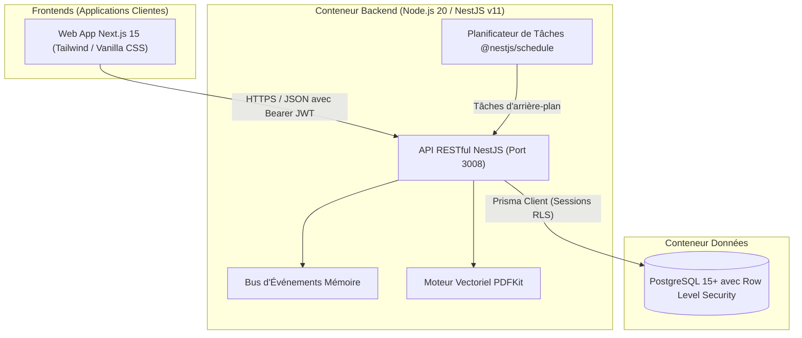
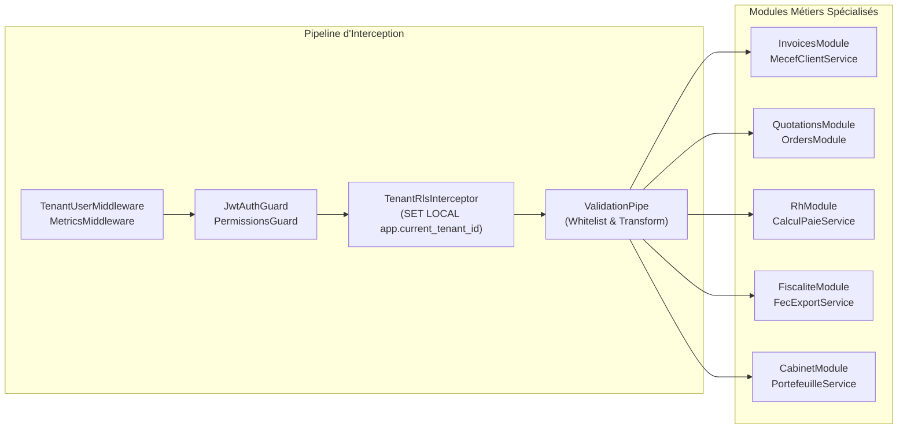

# Architecture Approfondie & Modélisation C4 — Backend Nexera ERP

---

## 1. Modélisation C4 du Système Nexera

### Niveau 1 : Diagramme de Contexte Système (System Context)

---

### Niveau 2 : Diagramme des Conteneurs (Container Diagram)

---

### Niveau 3 : Diagramme des Composants Backend (Component Diagram)

---

## 2. Cycle de Vie d'une Requête Authentifiée

1. **Extraction de la Signature JWT** : Le middleware valide la présence de l'en-tête `Authorization: Bearer <TOKEN>`.
2. **Contrôle d'Authenticité** : `JwtStrategy` vérifie la validité cryptographique du token via `JWT_SECRET`. Le payload décodé est attaché à l'objet `request.user`.
3. **Contrôle des Privilèges RBAC** : `PermissionsGuard` compare les permissions exigées par `@Permissions(...)` sur la route avec celles du profil utilisateur. En cas d'inadéquation, un statut `HTTP 403 Forbidden` est retourné sans exécuter le contrôleur.
4. **Verrouillage de l'Isolation RLS** : `TenantRlsInterceptor` transmet à la connexion PostgreSQL active la commande `SET LOCAL app.current_tenant_id = request.user.tenantId`.
5. **Assainissement des Données** : `ValidationPipe` désérialise et valide le corps de la requête selon les règles définies dans le DTO.
6. **Exécution du Service Métier** : La logique applicative s'exécute dans un contexte totalement hermétique.
