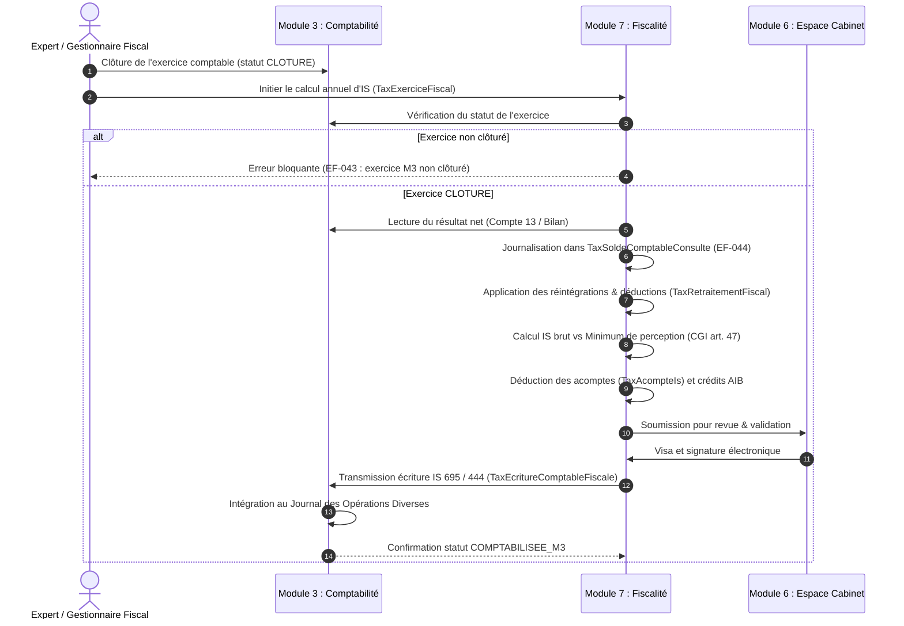

# NEXERA — SPÉCIFICATION D'ARCHITECTURE ET GUIDE MÉTIER
## MODULE 7 : FISCALITÉ — RELATIONS INTER-MODULES ET LOGIQUE FONCTIONNELLE

**Version :** 1.0 — Septembre 2026  
**Statut :** Document d'Architecture & Guide de Prise en Main Développeur / Métier  
**Périmètre :** Plateforme NEXERA ERP (OHADA / UEMOA / République du Bénin — Architecture Multi-pays)  
**Schéma PostgreSQL :** `tax` | **Couleur de module :** Ambre `#BA7517`

---

## 1. INTRODUCTION & VISION ARCHITECTURALE

### 1.1 Rôle et Positionnement du Module 7
Au sein de l'écosystème NEXERA, le **Module 7 — Fiscalité** n'est ni un simple sous-module comptable, ni un générateur d'états d'édition a posteriori. Il constitue le **point de convergence déclaratif de l'ensemble de l'ERP**.

Il a pour mission de :
1. **Capter en temps réel** les faits générateurs d'impôts et taxes produits par les modules opérationnels (Ventes, Achats, Notes de frais, Paie).
2. **Liquider** (calculer) la charge fiscale conformément aux règles fiscales locales en vigueur (TVA, AIB, Impôt sur les Sociétés / IBA, TPS, Patente, taxes diverses).
3. **Produire les déclarations fiscales réglementaires et la liasse fiscale annuelle** (conforme SYSCOHADA).
4. **Piloter le calendrier fiscal consolidé** de l'entité (échéancier unifié social et fiscal, alertes proactives).
5. **Assurer la télétransmission (EDI)** vers l'administration fiscale (DGI) et gérer la traçabilité des accusés de réception.
6. **Rétrocéder à la comptabilité** l'écriture d'imposition annuelle (charge d'IS).

```
   +-------------------------------------------------------------------------+
   |                     ESPACE ENTREPRISE (Bleu #1B3A6B)                    |
   |                                                                         |
   |  [M1 Stock]     [M2 Gestion Co]     [M4 RH & Paie]     [M5 Notes Frais] |
   +-------+---------------+--------------------+------------------+---------+
           |               |                    |                  |
           | (Indirect via | (Ventes / Achats   | (Obligations     | (TVA sur
           |  inventaire)  |  TVA & AIB)        |  ITS/VPS/CNSS)   |  frais)
           v               v                    v                  v
   +-------------------------------------------------------------------------+
   |             MODULE 7 — FISCALITÉ (Transversal, Ambre #BA7517)           |
   |                                                                         |
   |  • Moteur fiscal générique multi-pays (tax_type, tax_bareme, param)    |
   |  • Déclarations périodiques (TVA, AIB, Retenues)                        |
   |  • Impôt sur les Sociétés & Liasse Fiscale SYSCOHADA                    |
   |  • Calendrier fiscal unifié & Alertes d'échéances                       |
   |  • Télétransmission EDI / DGI & Dégradation contrôlée                   |
   |  • Suivi des contrôles fiscaux, pénalités et contentieux                |
   +-----------------------+----------------------------------+--------------+
                           |                                  ^
       (Résultat clôturé   | (Écriture retour                 | (Revue, visa
        & audit solde)     |  IS 695 / 444)                   |  liasse & planning)
                           v                                  |
   +---------------------------------------+  +---------------+--------------+
   |         M3 — COMPTABILITÉ             |  |   M6 — ESPACE CABINET        |
   |     (SYSCOHADA, Écritures FEC)        |  |  (Supervision & Signature)   |
   +---------------------------------------+  +------------------------------+
```

### 1.2 Principes Fondateurs Non Négociables
* **EF-001 — Généricité avant spécificité :** Aucune taxe n'a de table dédiée par défaut. Tout impôt est une instance paramétrable du catalogue générique `tax_type`, associé à des barèmes versionnés (`tax_bareme`) et des paramètres nationaux (`tax_parametre_pays`). Seules la TVA et l'IS disposent de tables spécialisées en raison de la complexité de leur cycle de vie.
* **EF-002 — Versioning et traçabilité réglementaire permanente :** Aucun taux, seuil ou barème n'est modifié en place ni codé en dur. Toute évolution crée une nouvelle version datée, obligatoirement adossée à une source réglementaire (`tax_source_reglementaire` : loi de finances, arrêté, circulaire, note de service).
* **EF-003 — Parallélisme strict des flux avec la comptabilité :** Pour les opérations courantes (ventes, achats, notes de frais, paie), l'événement opérationnel génère **simultanément et indépendamment** sa conséquence comptable dans M3 et sa conséquence fiscale dans M7. M7 ne lit jamais les comptes 4431 ou 4452 dans M3.
* **EF-004 — Non-substitution à l'administration :** Le module calcule ce qui est déclaré selon les règles légales ; il ne présume jamais d'un arbitrage administratif et conserve l'historique complet pour contrôle fiscal.
* **EF-005 — Portabilité et réversibilité totale :** Importation et exportation de tout l'historique fiscal (CSV, XLSX, JSON, XML) via connecteurs tracés.

---

## 2. TYPOLOGIE DES FLUX INTER-MODULES

Les interactions entre le Module 7 et les autres modules de NEXERA se décomposent en trois grandes natures de flux :

| Type de flux | Modules concernés | Description technique | Fréquence / Déclencheur |
|---|---|---|---|
| **Flux 1 : Parallèle Synchrone** | **M2 (Gestion Co)**<br>**M5 (Notes Frais)** | Capture instantanée d'un événement opérationnel validé. Alimente la table pivot `tax_evenement_source`. | Temps réel (à la validation de facture ou approbation de note de frais). |
| **Flux 2 : Poussé Pré-calculé** | **M4 (RH & Paie)** | Transmission d'obligations sociales et fiscales déjà liquidées par la paie vers `tax_obligation_paie_recue`. | Mensuel (à la clôture du cycle de paie). |
| **Flux 3 : Séquentiel Unique & Flux Retour** | **M3 (Comptabilité)** | 1. Lecture du résultat comptable net après clôture d'exercice.<br>2. Émission de l'écriture retour d'IS vers `tax_ecriture_comptable_fiscale`. | Annuel (lors de l'arrêté des comptes et liquidation d'IS). |
| **Flux 4 : Supervision & Visa** | **M6 (Espace Cabinet)** | Consultation en lecture seule, validation croisée, signature électronique et agrégation portefeuille. | Continu / Échéances déclaratives. |

---

## 3. LOGIQUE FONCTIONNELLE ET MÉTIER DÉTAILLÉE PAR MODULE

### 3.1 Interface avec le Module 2 — Gestion Commerciale (Ventes & Achats)

#### A. Logique Métier
Dans le commerce interentreprises et de détail :
1. **TVA (Taxe sur la Valeur Ajoutée) :**
   * **Vente taxable :** Toute facture client validée génère de la TVA collectée.
   * **Vente exonérée :** Exportations ou biens exonérés (ex: produits pharmaceutiques de base, denrées de première nécessité) tracés distinctement.
   * **Achat déductible :** Toute facture fournisseur validée ouvre droit à déduction de TVA, sous réserve du statut assujetti du fournisseur.
2. **AIB (Acompte sur Impôt assis sur les Bénéfices — Régime Bénin CGI 2026 art. 147 à 150) :**
   * Tout achat ou vente peut donner lieu à une retenue à la source AIB selon la nature de l'opération et l'immatriculation du tiers :
     * **1 % :** Ventes de marchandises aux personnes physiques ou morales immatriculées à l'IFU (revendeurs).
     * **3 % :** Prestations de services facturées par des personnes immatriculées à l'IFU, ou importations.
     * **5 % :** Ventes ou prestations réalisées au profit de tiers non immatriculés (sans IFU valide).
   * L'AIB subi par l'entreprise constitue un **crédit d'impôt imputable sur l'IS annuel**.
   * L'AIB retenu sur les tiers doit être **reversé à l'État** lors de la déclaration mensuelle.

#### B. Mécanisme Technique & Contrat de Données
1. **Création de l'événement source :**
   À la validation d'une facture de vente ou d'achat dans M2, un appel de service interne injecte une ligne dans `tax_evenement_source` :
   ```json
   {
     "moduleSource": "M2_GESTION_COMMERCIALE",
     "typeEvenement": "FACTURE_VENTE_VALIDEE",
     "referenceObjetSource": "FAC-2026-09-00124",
     "taxContribuableId": "uuid-contribuable",
     "dateEvenement": "2026-09-25T10:00:00Z",
     "montantHt": 5000000.00,
     "montantTaxe": 900000.00,
     "natureFiscale": "TVA_COLLECTEE_18",
     "statutTraitement": "RECU"
   }
   ```
2. **Consommation par le moteur fiscal :**
   * Le service fiscal traite l'événement et crée une ligne dans `TaxDeclarationTvaLigne` liée à la `TaxDeclarationTva` de la période courante (ex: `2026-09`).
   * Si une retenue AIB est identifiée, une ligne est enregistrée dans `TaxRetenueAib` avec `imputable_is = true` (pour un achat subi) ou `false` (pour une vente retenue à reverser).
   * Le statut de `TaxEvenementSource` passe à `INTEGRE_DECLARATION`.

---

### 3.2 Interface avec le Module 3 — Comptabilité (SYSCOHADA)

#### A. Logique Métier
La comptabilité et la fiscalité ont des finalités différentes : la comptabilité constate la réalité économique selon les normes SYSCOHADA ; la fiscalité applique les règles d'assiette et de taux de l'État.

* **Parallélisme pour l'exploitation :** M7 ne lit pas les comptes 4431 (TVA facturée), 4452 (TVA récupérable) ou 4492 (AIB). Il dispose de sa propre base d'événements. Cela permet d'effectuer un **rapprochement fiscal / comptable** sans circularité de données.
* **L'Exception Majeure de l'Impôt sur les Sociétés (IS) :**
  L'assiette de l'IS est le **résultat fiscal**. Or, le résultat fiscal est obtenu en appliquant des retraitements extra-comptables au **résultat comptable net** :
  $$\text{Résultat Fiscal} = \text{Résultat Net Comptable} + \text{Réintégrations} - \text{Déductions}$$

#### B. Le Processus d'Arrêté Fiscal Annuel


#### C. Contrat de Données & Traçabilité (EF-043, EF-044, EF-045)
1. **Audit de lecture du résultat :**
   Chaque consultation est immortalisée dans `TaxSoldeComptableConsulte` :
   * `compteSyscohadaConsulte` : `"131100"` (Résultat net bénéficiaire)
   * `soldeLu` : `45230000.00`
   * `exerciceComptableStatutALaLecture` : `"CLOTURE"`
2. **Génération de l'écriture retour :**
   Table `TaxEcritureComptableFiscale` :
   * `compteDebitSyscohada` : `"695100"` (Impôts sur les bénéfices de l'exercice)
   * `compteCreditSyscohada` : `"444100"` (État, impôt sur les bénéfices)
   * `montant` : `13569000.00`
   * `statut` : `GENEREE` ➔ `TRANSMISE_M3` ➔ `COMPTABILISEE_M3`

---

### 3.3 Interface avec le Module 4 — RH & Paie

#### A. Logique Métier
Dans l'espace OHADA / UEMOA (notamment au Bénin selon le CGI 2026) :
* L'impôt sur les salaires (**ITS** : Impôt sur les Traitements et Salaires), le **VPS** (Versement Patronal sur Salaires) et les cotisations sociales (**CNSS** prestations familiales, accidents du travail, retraite) sont calculés nominativement bulletin par bulletin dans le Module 4.
* **Règle fondamentale (EF-040) : Consolidation, jamais de recalcul.**
  Le Module 7 n'a pas à recalculer l'ITS ni la CNSS. M4 est l'autorité absolue sur le calcul de la paie. M7 intervient comme **plateforme de consolidation des échéances et de paiement**.

#### B. Processus d'Alimentation
1. À la clôture mensuelle du cycle de paie dans M4, M4 génère un objet `RhDeclarationSocialeFiscale`.
2. M4 pousse cet objet dans `tax_obligation_paie_recue` (M7) :
   ```json
   {
     "taxContribuableId": "uuid-contribuable",
     "referenceObjetM4": "PAIE-2026-09-DECLARATION-GLOBALE",
     "typeObligation": "ITS_VPS_CNSS_BENIN",
     "periode": "2026-09",
     "montant": 2840000.00,
     "dateLimiteLegale": "2026-10-10",
     "statut": "RECUE"
   }
   ```
3. **M7 intègre l'obligation dans son calendrier fiscal unifié (`TaxEcheance`) :**
   * L'échéance du 10 du mois suivant est armée.
   * Les alertes préventives (J-7, J-3) sont programmées.
   * En cas de non-déclaration au 10 octobre à minuit, M7 bascule l'échéance en `EN_RETARD` et estime automatiquement les pénalités de retard (CGI 2026 art. 485 à 488).

---

### 3.4 Interface avec le Module 5 — Notes de Frais

#### A. Logique Métier
Les frais professionnels engagés par les collaborateurs posent deux problématiques fiscales :
1. **La récupération de la TVA :** La TVA sur les frais de déplacement, d'hébergement, de réception et de carburant n'est déductible que si la réglementation du pays l'autorise expressément et si une facture normalisée conforme est jointe.
2. **La déductibilité de la charge pour l'IS :** Selon les articles 20 et 22 du CGI Bénin 2026, une note de frais n'est déductible que si :
   * Elle est appuyée d'un justificatif régulier.
   * Elle est engagée dans l'intérêt direct de l'entreprise.
   * Elle n'excède pas les plafonds légaux de paiement en espèces.
   * Elle ne relève pas de charges somptuaires non admises (ex: réceptions excessives, cadeaux au-delà du seuil admis).

#### B. Processus d'Intégration
1. **Détection de la TVA déductible :**
   Lorsqu'un rapport de frais est approuvé dans M5, pour chaque dépense éligible à la déduction, un événement est envoyé à `TaxEvenementSource` :
   * `moduleSource` : `M5_NOTES_FRAIS`
   * `typeEvenement` : `NOTE_FRAIS_APPROUVEE`
   * `natureFiscale` : `NOTE_FRAIS_DEDUCTIBLE`
   * Cet événement incrémente directement la TVA déductible de la déclaration de TVA en cours.
2. **Alimentation des retraitements fiscaux (IS) :**
   Les dépenses rejetées pour motif fiscal (justificatif manquant, paiement espèces dépassant le plafond légal de 100 000 FCFA) sont identifiées dans M5. M7 peut ainsi préremplir le tableau des **réintégrations fiscales** (`TaxRetraitementFiscal`, type `REINTEGRATION`) pour le calcul de l'IS de fin d'exercice.

---

### 3.5 Interface avec le Module 6 — Espace Cabinet (Experts-Comptables)

#### A. Logique Métier
Le Module 6 est l'outil du cabinet d'expertise comptable qui gère un portefeuille de plusieurs entreprises clientes.
* **Séparation stricte des pouvoirs :** L'Espace Cabinet **supervise, révise, commente et valide**. Il ne crée pas manuellement d'écritures fiscales dans le schéma client.
* **Le Workflow de Double Contrôle Fiscal :**
  Toute modification d'un barème fiscal ou dépôt officiel de liasse fiscale annuelle requiert une validation de l'expert-comptable (ou du superviseur cabinet) pour garantir la sécurité juridique du client.

#### B. Interconnexions Clés
1. **Le Calendrier Consolidé Multi-Dossiers :**
   Le tableau de bord du cabinet agrège toutes les lignes de `TaxEcheance` de tous ses clients dans la vue consolidée `CabinetEcheanceConsolidee`. L'expert-comptable visualise sur un calendrier unique les échéances de TVA du 15, les retenues du 10, et les acomptes d'IS de l'ensemble de son portefeuille.
2. **Revue de la Liasse Fiscale & Télédéclaration :**
   * M7 génère la liasse (`TaxLiasseFiscale`, statut `GENEREE`).
   * L'expert-comptable ouvre la liasse dans M6, contrôle la cohérence bilan / compte de résultat / tableau d'amortissement fiscal, effectue des points de revue (`CabinetPointRevue`).
   * Une fois validée (`valideParCabinet = true`), la liasse passe en statut `VALIDEE` et peut être transmise par le connecteur EDI vers le portail de la DGI.

---

### 3.6 Relation avec le Module 1 — Stock

Bien qu'il n'y ait pas d'écriture directe entre M1 et M7 en continu, la liaison est assurée par l'intermédiaire de M3 et des régularisations périodiques :
* **Valorisation et dépréciations :** Les variations de stock et les provisions pour dépréciation calculées dans M1 se déversent dans le résultat comptable de M3, qui détermine in fine l'assiette d'IS dans M7.
* **Régularisations de TVA sur rebuts / pertes :** En cas de vol, casse ou destruction de stock non justifiée par procès-verbal légal, la TVA initialement déduite sur ces marchandises doit être reversée à l'État. Ces ajustements sont saisis via les régularisations de TVA dans M7.

---

## 4. LE MOTEUR FISCAL GÉNÉRIQUE MULTI-PAYS

### 4.1 Architecture en 3 Couches du Moteur
Pour éviter de réécrire le code lors de changements législatifs permanents ou d'un déploiement dans un nouveau pays de la zone UEMOA/CEMAC, le moteur fiscal repose sur le triptyque :

```
   +------------------------------------------------------------------------+
   | Couche 1 : CATALOGUE ABSTRAIT (tax_type)                               |
   | - Catégorie : IMPOT_RESULTAT, TAXE_CHIFFRE_AFFAIRES, RETENUE_SOURCE... |
   | - Périodicité : MENSUELLE, TRIMESTRIELLE, ANNUELLE                     |
   | - Mode de calcul : TAUX_UNIQUE, BAREME_PROGRESSIF, TRANCHE_CA...       |
   +-----------------------------------+------------------------------------+
                                       | 1:N
                                       v
   +------------------------------------------------------------------------+
   | Couche 2 : BARÈMES & TRANCHES VERSIONNÉS (tax_bareme & tranche)        |
   | - Date de début et date de fin de validité                             |
   | - Taux, planchers, plafonds, décotes, abattements                      |
   | - Statut : BROUILLON -> VALIDE -> ACTIF -> REMPLACE                    |
   | - Rattaché obligatoirement à tax_source_reglementaire                  |
   +-----------------------------------+------------------------------------+
                                       | 1:N
                                       v
   +------------------------------------------------------------------------+
   | Couche 3 : PARAMÈTRES PAYS & CONTRIBUABLE (tax_parametre_pays)         |
   | - Seuil d'assujettissement (ex: seuil TVA = 50 000 000 FCFA au Bénin) |
   | - Taux de pénalité de retard, délai légal de reversement               |
   | - Options du contribuable (Régime Réel Normal, Simplifié, TPS...)      |
   +------------------------------------------------------------------------+
```

### 4.2 La Veille Réglementaire Active (Section 5 du SFD)
Aucun paramètre fiscal ne peut exister dans le système sans être rattaché à une ligne de `TaxSourceReglementaire`.
* **Cycle de vie de la source réglementaire :**
  `A_QUALIFIER` ➔ `QUALIFIEE` ➔ `PARAMETRAGE_EN_COURS` ➔ `APPLIQUEE`
* **Sécurité juridique (EF-048) :** L'activation d'un barème exige un workflow de double signature (Créateur de la règle $\neq$ Valideur).

---

## 5. CYCLE DÉCLARATIF, CALENDRIER & CONTENTIEUX

### 5.1 Calendrier Fiscal Automatisé & Sanctions (EF-027, EF-033)
Dès qu'un contribuable est actif, le système génère son échéancier pour l'année civile :
1. **Échéances récurrentes :**
   * **10 du mois :** Déclarations des retenues à la source sur salaires (ITS, VPS, CNSS).
   * **15 du mois :** Déclaration de TVA et d'AIB du mois précédent.
   * **10 mars :** 1er acompte provisionnel d'IS (25 % de l'impôt précédent + redevance).
   * **30 avril :** Déclaration annuelle de résultat (Liasse fiscale SYSCOHADA) et solde de liquidation d'IS.
   * **10 juin & 10 octobre :** 2e et 3e acomptes d'IS.
2. **Calcul automatique des pénalités estimées (Bénin CGI 2026 art. 485 à 488) :**
   * Retard de déclaration : 20 % des droits simples (porté à 40 % après mise en demeure).
   * Insuffisance de déclaration : 20 % (bonne foi) à 80 % (manœuvres frauduleuses).
   * Retard de paiement : 10 % sur le principal et sur chaque acompte échu.
   * Intérêts de retard : 0,25 % par mois de retard entamé.

### 5.2 Télédéclaration EDI & Dégradation Contrôlée (EF-030 à EF-032)
* Le connecteur DGI (`TaxConnecteurDgi`) supporte plusieurs protocoles : `API_REST` (webservices fiscaux nationaux), `EDI_XML` ou `DEPOT_FICHIER_PORTAIL`.
* En cas d'indisponibilité ou d'absence d'interface numérique dans le pays concerné, la règle de **dégradation contrôlée** génère un bordereau PDF normalisé strictement identique au formulaire officiel de la DGI, sans bloquer le suivi de l'échéance dans NEXERA.

---

## 6. GUIDE DE PRISE EN MAIN & CONTRACTS POUR DÉVELOPPEURS

### 6.1 Modèle de Données Clé (Prisma Schema Reference)

```prisma
// 1. Capture de l'événement source (Ventes, Achats, Frais)
model TaxEvenementSource {
  id                    String                    @id @default(uuid())
  moduleSource          TaxModuleSource           @map("module_source") // M2_GESTION_COMMERCIALE, M4_RH_PAIE, M5_NOTES_FRAIS
  typeEvenement         String                    @map("type_evenement")
  referenceObjetSource  String                    @map("reference_objet_source")
  taxContribuableId     String                    @map("tax_contribuable_id")
  dateEvenement         DateTime                  @map("date_evenement")
  montantHt             Float?                    @map("montant_ht")
  montantTaxe           Float?                    @map("montant_taxe")
  natureFiscale         String?                   @map("nature_fiscale")
  statutTraitement      TaxStatutTraitementSource @default(RECU) @map("statut_traitement")
  createdAt             DateTime                  @default(now()) @map("created_at")
  updatedAt             DateTime                  @updatedAt @map("updated_at")

  contribuable          TaxContribuable           @relation(fields: [taxContribuableId], references: [id], onDelete: Cascade)
  lignesTva             TaxDeclarationTvaLigne[]
  retenuesAib           TaxRetenueAib[]

  @@index([taxContribuableId, moduleSource, statutTraitement])
  @@map("tax_evenement_source")
}

// 2. Écriture de retour comptable vers M3
model TaxEcritureComptableFiscale {
  id                    String                  @id @default(uuid())
  taxContribuableId     String                  @map("tax_contribuable_id")
  objetSourceType       String                  @map("objet_source_type") // CALCUL_IS, LIQUIDATION_TPS...
  objetSourceId         String                  @map("objet_source_id")
  dateEcriture          DateTime                @map("date_ecriture") @db.Date
  compteDebitSyscohada  String                  @map("compte_debit_syscohada") // Ex: 695100
  compteCreditSyscohada String                  @map("compte_credit_syscohada") // Ex: 444100
  montant               Float                   @map("montant")
  statut                TaxStatutEcritureFiscale @default(GENEREE) @map("statut") // GENEREE -> TRANSMISE_M3 -> COMPTABILISEE_M3
  referenceEcritureM3   String?                 @map("reference_ecriture_m3")
  createdAt             DateTime                @default(now()) @map("created_at")
  updatedAt             DateTime                @updatedAt @map("updated_at")

  contribuable          TaxContribuable         @relation(fields: [taxContribuableId], references: [id], onDelete: Cascade)

  @@index([taxContribuableId, statut])
  @@map("tax_ecriture_comptable_fiscale")
}

// 3. Traçabilité d'audit de la consultation du résultat net comptable
model TaxSoldeComptableConsulte {
  id                                  String            @id @default(uuid())
  taxExerciceFiscalId                 String            @map("tax_exercice_fiscal_id")
  compteSyscohadaConsulte             String            @map("compte_syscohada_consulte") // Ex: 131100
  soldeLu                             Float             @map("solde_lu")
  dateConsultation                    DateTime          @default(now()) @map("date_consultation")
  exerciceComptableStatutALaLecture   String            @map("exercice_comptable_statut_a_la_lecture") // "CLOTURE"
  createdAt                           DateTime          @default(now()) @map("created_at")

  exerciceFiscal                      TaxExerciceFiscal @relation(fields: [taxExerciceFiscalId], references: [id], onDelete: Cascade)

  @@map("tax_solde_comptable_consulte")
}
```

### 6.2 Checklist d'Implémentation d'une Nouvelle Intégration
Lors du développement d'une nouvelle fonctionnalité impactant la fiscalité :
1. **Identifier le module émetteur :**
   * Si opération commerciale (Vente / Achat) ➔ Créer un `TaxEvenementSource` avec `M2_GESTION_COMMERCIALE`.
   * Si dépense de collaborateur ➔ Créer un `TaxEvenementSource` avec `M5_NOTES_FRAIS`.
   * Si obligation salariale ➔ Créer un `TaxObligationPaieRecue` avec `referenceObjetM4`.
2. **Ne jamais injecter d'écriture directe dans M3 depuis le code métier :**
   * Tout impact fiscal sur la comptabilité doit être encapsulé dans `TaxEcritureComptableFiscale` et suivre le cycle d'approbation asynchrone (`TRANSMISE_M3` ➔ `COMPTABILISEE_M3`).
3. **Respecter l'isolation Multi-tenant (RLS) :**
   * Toujours inclure `taxContribuableId` et `tenant_id` dans toutes les requêtes.
4. **Vérifier le rattachement à la source réglementaire :**
   * Tout nouveau taux ou exonération doit pointer vers un ID existant dans `TaxSourceReglementaire`.

---
*Ce document de référence est maintenu en stricte synchronisation avec la SFD M7 v1.0, le MBD M7 v1.0 et les dispositions du Code Général des Impôts (Bénin 2026 / SYSCOHADA).*
