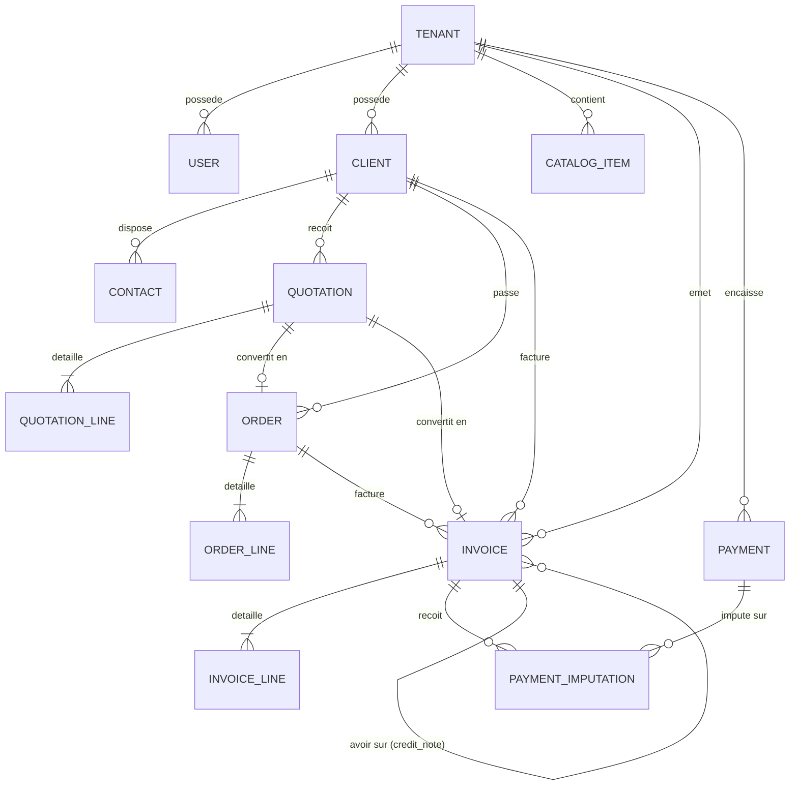

# Dictionnaire de Données & Modèle Entité-Relation — Backend Nexera ERP

---

## 1. Diagramme Entité-Relation Principal (ERD Mermaid)

---

## 2. Dictionnaire des Données Détaillé

### 2.1 Table `tenants` (Organisations Clientes)
| Colonne | Type SQL | Nullable | Contraintes | Description |
| :--- | :--- | :--- | :--- | :--- |
| `id` | `VARCHAR(36)` | Non | PK (UUID) | Identifiant unique universel du tenant. |
| `name` | `VARCHAR(255)` | Non | - | Nom usuel de l'organisation. |
| `slug` | `VARCHAR(100)` | Non | Unique | Identifiant URL court. |
| `is_active` | `BOOLEAN` | Non | Default true | État de la souscription du tenant. |
| `created_at` | `TIMESTAMP` | Non | Default now() | Date de création de l'espace. |

### 2.2 Table `tenant_settings` (Configuration Entreprise & e-MECeF)
| Colonne | Type SQL | Nullable | Description |
| :--- | :--- | :--- | :--- |
| `id` | `VARCHAR(36)` | Non | PK (UUID). |
| `tenant_id` | `VARCHAR(36)` | Non | FK unique vers `tenants(id)`. |
| `primary_currency`| `VARCHAR(3)` | Non | Code ISO de la devise (défaut `EUR` ou `XOF`). |
| `legal_name` | `VARCHAR(255)` | Oui | Raison sociale officielle de l'entreprise. |
| `vat_number` | `VARCHAR(50)` | Oui | Numéro IFU (Identifiant Fiscal Unique) de l'entreprise. |
| `siret` | `VARCHAR(50)` | Oui | Numéro RCCM ou SIRET. |
| `mecef_api_url` | `VARCHAR(255)` | Oui | URL officielle du serveur e-MECeF DGI Bénin. |
| `mecef_api_key` | `TEXT` | Oui | Clé secrète / Token API délivré par la DGI. |
| `mecef_nim` | `VARCHAR(50)` | Oui | Numéro d'Identification de la Machine (NIM officiel). |
| `mecef_environment`| `VARCHAR(20)` | Non | `sandbox` (test) ou `production` (réel DGI). |
| `mecef_auto_normalize`| `BOOLEAN` | Non | Active la certification automatique dès émission. |

### 2.3 Table `invoices` (Factures & Avoirs)
| Colonne | Type SQL | Nullable | Description |
| :--- | :--- | :--- | :--- |
| `id` | `VARCHAR(36)` | Non | PK (UUID). |
| `tenant_id` | `VARCHAR(36)` | Non | FK vers `tenants(id)` (isolation RLS). |
| `number` | `VARCHAR(50)` | Non | Numéro officiel unique (ex. `FACT-202609-0012`). |
| `invoice_type` | `VARCHAR(20)` | Non | `standard`, `deposit`, `credit_note`, `proforma`. |
| `status` | `VARCHAR(20)` | Non | `draft`, `issued`, `paid`, `partially_paid`, `cancelled`. |
| `client_id` | `VARCHAR(36)` | Non | FK vers `clients(id)`. |
| `issue_date` | `TIMESTAMP` | Non | Date officielle d'émission de la facture. |
| `due_date` | `TIMESTAMP` | Oui | Date limite de paiement. |
| `base_ht` | `FLOAT` | Non | Base totale Hors Taxe. |
| `total_tax` | `FLOAT` | Non | Montant total de la TVA. |
| `total_ttc` | `FLOAT` | Non | Montant total TTC. |
| `amount_paid` | `FLOAT` | Non | Cumul des montants effectivement encaissés. |
| `amount_due` | `FLOAT` | Non | Solde restant dû ($TTC - Payé$). |
| `normalization_status`| `VARCHAR(20)`| Non | `not_normalized`, `pending`, `normalized`, `failed`. |
| `mecef_nim` | `VARCHAR(50)` | Oui | NIM de la machine ayant signé la facture. |
| `mecef_counters`| `VARCHAR(50)` | Oui | Compteurs séquentiels officiels DGI (ex. `15/45 FV`). |
| `mecef_code` | `VARCHAR(100)`| Oui | Signature cryptographique officielle DGI (`BJ01-...`). |
| `mecef_qr_code_data`| `TEXT` | Oui | Données textuelles / URL vérifiable du QR Code. |
| `mecef_tax_group_totals`| `JSONB` | Oui | Détail de ventilation par groupes A, B, C, D, E. |
| `mecef_aib_type`| `VARCHAR(10)` | Non | `NONE`, `A` (1%), `B` (5%). |
| `mecef_aib_amount`| `FLOAT` | Non | Montant de l'acompte AIB calculé. |
| `original_mecef_code`| `VARCHAR(100)`| Oui | Code MECeF d'origine si facture d'avoir (`FA`). |

---

## 3. Règles d'Intégrité Référentielle Stricte

- **Interdiction de Suppression en Cascade sur Documents Financiers** :
  Toute tentative de suppression d'un client ayant déjà des factures émises est bloquée par contrainte relationnelle (`ON DELETE RESTRICT`).
- **Immuabilité Comptable** :
  Une fois qu'une facture est au statut `issued` ou `normalized`, les lignes de détail `invoice_lines` sont verrouillées par trigger applicatif interdisant tout `UPDATE` ou `DELETE`.
