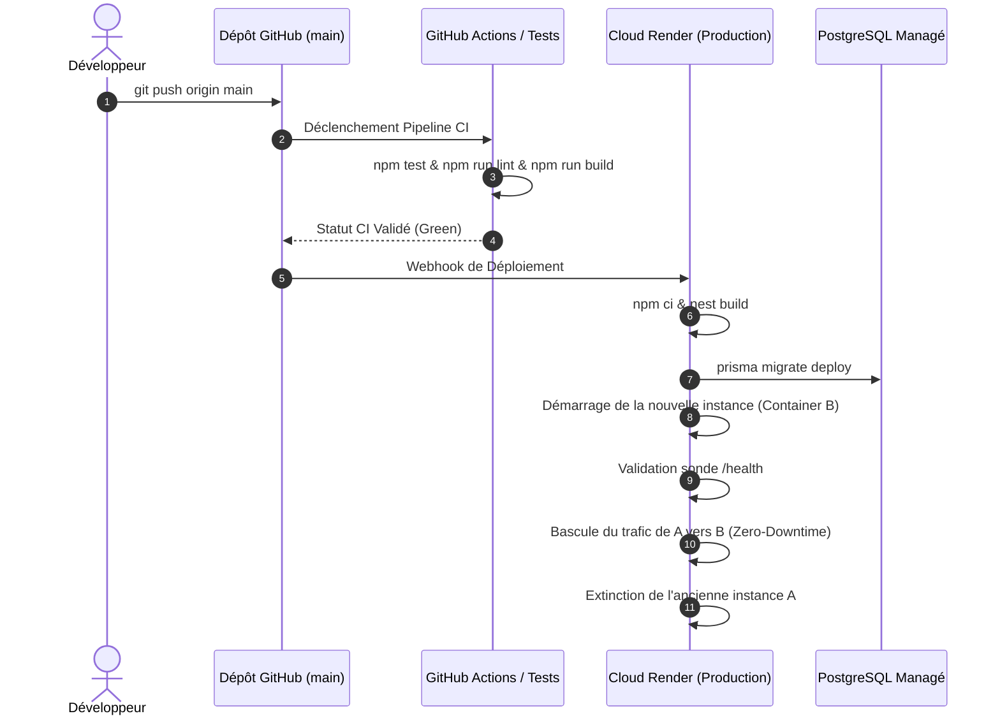

# Procédures Opérationnelles de Déploiement & Exploitation — Backend Nexera ERP

---

## 1. Pipeline de Déploiement Continu (CI/CD)

Le déploiement en production est automatisé et suit un flux sécurisé :



---

## 2. Déploiement Zéro Interruption (Zero-Downtime)

Pour éviter toute coupure de service lors des mises à jour :
1. **Migrations Rétrocompatibles (Expand & Contract Pattern)** :
   - Ne jamais supprimer ni renommer une colonne directement en une seule migration.
   - Étape 1 : Ajouter la nouvelle colonne optionnelle.
   - Étape 2 : Déployer le nouveau code qui écrit dans les deux colonnes.
   - Étape 3 : Remplir l'ancienne colonne et migrer la lecture.
   - Étape 4 : Déprécier et supprimer l'ancienne colonne dans une version ultérieure.
2. **Health Check Probes** :
   Le routeur Render / Nginx ne redirige le trafic utilisateur vers la nouvelle instance que lorsque `/health/readiness` renvoie `HTTP 200 OK`.

---

## 3. Procédure de Rollback d'Urgence

Si une anomalie critique survient immédiatement après un déploiement :

### Étape 1 : Rétablissement de la Version Précédente du Code
Sur l'interface Render ou via la CLI Git :
```bash
# Identifier le commit stable précédent
git log --oneline -n 5

# Forcer le redéploiement du commit stable précédent
git revert HEAD --no-edit
git push origin main
```

### Étape 2 : Restauration de Base de Données (si migration corrompue)
En cas de corruption de schéma :
```bash
# Restauration d'un backup automatique via pg_restore
pg_restore -h <DB_HOST> -U <DB_USER> -d <DB_NAME> --clean --no-owner backup_pre_deploy.dump
```

---

## 4. Sauvegardes & Rétention des Données

- **Snapshots Quotidiens Automatiques** : Réalisés par le fournisseur de base de données managée avec conservation glissante sur **30 jours**.
- **Sauvegarde Hebdomadaire Froide Externe** : Export `pg_dump` compressé et chiffré stocké sur un stockage objet distinct (AWS S3 ou Cloud équivalent) avec politique d'immutabilité WORM (*Write Once Read Many*).
