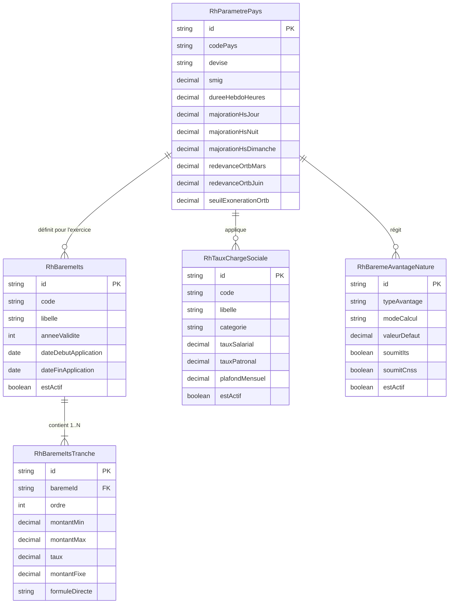
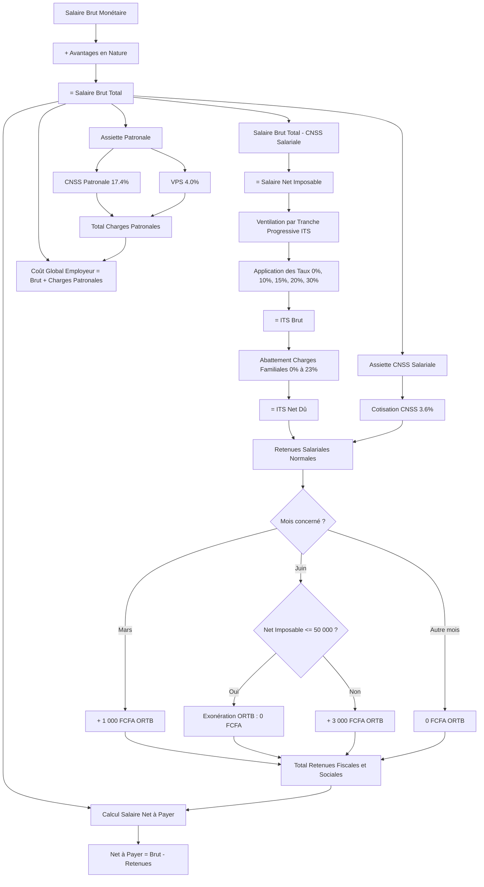

# ⚖️ 04b — Référentiel des Barèmes Fiscaux, Cotisations Sociales & Paramètres Légaux

Ce document détaille l'architecture, la logique métier fonctionnelle et les règles de calcul associées aux **barèmes fiscaux (ITS)**, **cotisations de sécurité sociale (CNSS)**, **versements patronaux (VPS)**, **avantages en nature** et **paramètres légaux de paie** dans Nexera.

---

## 1. Cadre Légal & Principes Directeurs

### A. Conformité Régionale & Légale
Le module est conçu en conformité stricte avec les dispositions du :
- **Code Général des Impôts (CGI) de la République du Bénin** (Loi de Finances 2026, notamment les articles 123, 125, 125-2, 127 et 191 à 195).
- **Code de Sécurité Sociale** (Caisse Nationale de Sécurité Sociale - CNSS Bénin).
- **Code du Travail** et décrets relatifs au Salaire Minimum Interprofessionnel Garanti (SMIG) et au temps de travail.
- **Normes comptables et sociales OHADA / UEMOA**.

### B. Règle d'Or : Zéro Taux Codé en Dur (EF-001)
Aucun taux, tranche ou plafond ne doit être fixé de manière immuable dans le code source. Toutes les valeurs proviennent des tables de référence dans le schéma PostgreSQL `rh_paie` :
- `RhBaremeIts` & `RhBaremeItsTranche`
- `RhTauxChargeSociale`
- `RhBaremeAvantageNature`
- `RhParametrePays`

Cette architecture garantit qu'en cas de modification des lois de finances ou des arrêtés ministériels, le gestionnaire RH peut créer ou dupliquer un barème sans nécessiter de redéploiement applicatif.

---

## 2. Modèle de Données & Tables de Référence



---

## 3. Logique Fonctionnelle Détaillée

### A. Barème Progressif de l'Impôt sur les Traitements et Salaires (ITS)

L'ITS (anciennement IPTS) est calculé par tranches progressives selon les dispositions de l'**Article 125 du CGI Bénin 2026** :

| Tranche | Ordre | Plage de Revenu Net Imposable (FCFA) | Taux Appliqué | Formule Directe Mensuelle |
| :---: | :---: | :--- | :---: | :--- |
| **T1** | 1 | De 0 à 50 000 | **0 %** | $0$ |
| **T2** | 2 | De 50 001 à 130 000 | **10 %** | $(R - 50\,000) \times 10\%$ |
| **T3** | 3 | De 130 001 à 280 000 | **15 %** | $8\,000 + (R - 130\,000) \times 15\%$ |
| **T4** | 4 | De 280 001 à 530 000 | **20 %** | $30\,500 + (R - 280\,000) \times 20\%$ |
| **T5** | 5 | Au-delà de 530 000 | **30 %** | $80\,500 + (R - 530\,000) \times 30\%$ |

#### 1. Règle d'Intégrité et de Continuité des Tranches
Le service backend (`ReferentielService`) exécute un contrôle strict de continuité lors de la création ou mise à jour par lot des tranches :
- **Séquentialité des ordres :** L'ordre des tranches doit démarrer à 1 et être strictement croissant sans interruption ($1, 2, 3, \dots$).
- **Absence de trous et de chevauchements :** La borne inférieure d'une tranche $n+1$ doit impérativement correspondre à la borne supérieure de la tranche $n$ (tolérance d'un pas de 1 FCFA : $\text{montantMin}_{n+1} \in [\text{montantMax}_n, \text{montantMax}_n + 1]$).
- **Complétude :** Seule la dernière tranche d'un barème peut avoir une borne supérieure nulle ou indéfinie (`montantMax = null`), symbolisant l'infini.

```typescript
// Validation algorithmique dans ReferentielService
private validateTranchesContinuity(tranches: { ordre: number; montantMin: number; montantMax?: number | null }[]) {
  const sorted = [...tranches].sort((a, b) => a.ordre - b.ordre);
  for (let i = 0; i < sorted.length; i++) {
    const curr = sorted[i];
    if (curr.ordre !== i + 1) {
      throw new BadRequestException(`Ordre invalide pour la tranche ${curr.ordre}. Attendu: ${i + 1}`);
    }
    if (i < sorted.length - 1) {
      if (!curr.montantMax || curr.montantMax <= curr.montantMin) {
        throw new BadRequestException(`La tranche ${curr.ordre} doit avoir un montantMax supérieur au montantMin`);
      }
      const next = sorted[i + 1];
      if (Math.abs(next.montantMin - curr.montantMax) > 1) {
        throw new BadRequestException(`Discontinuité détectée entre la tranche ${curr.ordre} (max: ${curr.montantMax}) et ${next.ordre} (min: ${next.montantMin})`);
      }
    }
  }
}
```

#### 2. Duplication et Versionnage Temporel
Pour amorcer un nouvel exercice fiscal sans altérer les calculs historiques :
1. Le gestionnaire RH sélectionne le barème actif de l'exercice $N$.
2. Il déclenche la duplication vers l'exercice $N+1$ via `POST /api/rh/referentiel/baremes-its/:id/dupliquer`.
3. Le système clone l'entête et l'intégralité des tranches associées dans une transaction atomique.
4. Si `activerImmediatement: true`, le nouveau barème devient la référence courante pour les calculs de paie.

#### 3. Abattement pour Charges de Famille (Art. 127 CGI)
L'impôt brut obtenu par l'application du barème progressif subit une réduction proportionnelle selon le nombre d'enfants et personnes à charge déclarées par le salarié :

| Nombre de Charges | Taux d'Abattement |
| :---: | :---: |
| 0 | 0 % |
| 1 | 5 % |
| 2 | 10 % |
| 3 | 15 % |
| 4 | 20 % |
| 5 et plus | 23 % |

$$\text{ITS Dû} = \max\left(0, \text{ITS Brut} \times (1 - \text{Taux Abattement})\right)$$

---

### B. Cotisations Sociales (CNSS) & Versement Patronal (VPS)

#### 1. Répartition des Cotisations CNSS
Le régime de sécurité sociale obligatoire comprend deux composantes :
- **Part Salariale (Ouvrière) :**
  - **Branche Retraite / Pension Vieillesse :** **3,6 %** de l'assiette brute soumise. Déductible du salaire brut pour déterminer l'assiette de l'ITS.
- **Part Patronale :** **17,4 %** au total, ventilée en 3 branches obligatoires :
  1. *Prestations Familiales :* **9,0 %** (charge exclusive de l'employeur).
  2. *Accidents du Travail et Maladies Professionnelles (AT/MP) :* **2,0 %** (taux moyen standard).
  3. *Assurance Vieillesse (Retraite Patronale) :* **6,4 %**.

#### 2. Versement Patronal sur Salaires (VPS)
Régie par les **Articles 191 à 195 du CGI Bénin**, cette taxe à la charge exclusive de l'employeur est assise sur la totalité des traitements, salaires, indemnités et émoluments :
- **Taux Général :** **4,0 %** de la masse salariale brute imposable.
- **Taux Spécifique Réduit :** **2,0 %** réservé aux établissements d'enseignement privés et aux centres de formation professionnelle agréés.

---

### C. Redevance Audiovisuelle ORTB (Art. 125-2 CGI Bénin)

La contribution pour le développement de la radiodiffusion et de la télévision nationale (ORTB) est retenue à la source par l'employeur selon un calendrier semestriel spécifique :

1. **Échéance de Mars :** Retenue obligatoire de **1 000 FCFA** pour tous les salariés.
2. **Échéance de Juin :** Retenue obligatoire de **3 000 FCFA**.
3. **Règle Légale d'Exonération en Juin :**
   Les salariés dont le salaire net imposable ne dépasse pas le plafond de la 1ère tranche du barème ITS (soit **≤ 50 000 FCFA**) sont **légalement exonérés** de la retenue de Juin :
   $$\text{Redevance ORTB}_{\text{Juin}} = \begin{cases} 0 \text{ FCFA} & \text{si } \text{Salaire Imposable} \le 50\,000 \text{ FCFA} \\ 3\,000 \text{ FCFA} & \text{si } \text{Salaire Imposable} > 50\,000 \text{ FCFA} \end{cases}$$

---

### D. Évaluation des Avantages en Nature (Art. 123 CGI Bénin 2026)

Lorsque l'entreprise fournit des commodités en nature au salarié, celles-ci sont évaluées forfaitairement ou au réel et réintégrées dans l'assiette brute :

| Avantage en Nature | Mode d'Évaluation Légal | Valeur Légale par Défaut | Soumis ITS | Soumis CNSS |
| :--- | :--- | :---: | :---: | :---: |
| **Logement de fonction** | Pourcentage de la rémunération brute globale | **15 %** | Oui | Oui |
| **Personnel de maison / Domestique** | Pourcentage de la rémunération brute | **15 %** | Oui | Oui |
| **Véhicule de fonction** | Montant forfaitaire mensuel | Paramétrable (ex: 50 000 FCFA) | Oui | Oui |
| **Électricité** | Montant forfaitaire mensuel | Paramétrable (ex: 25 000 FCFA) | Oui | Oui |
| **Eau** | Montant forfaitaire mensuel | Paramétrable (ex: 10 000 FCFA) | Oui | Oui |
| **Téléphone / Internet** | Montant forfaitaire mensuel | Paramétrable (ex: 15 000 FCFA) | Oui | Non |

$$\text{Salaire Brut Total} = \text{Salaire de Base} + \text{Primes & Indemnités} + \sum \text{Avantages en Nature}$$

---

### E. Paramètres Pays & Normes du Travail

Le modèle `RhParametrePays` centralise les référentiels nationaux :
- **SMIG Bénin :** Fixé à **52 000 FCFA / mois** (Décret n° 2022-763). Tout contrat à temps plein inférieur à ce montant génère une alerte bloquante.
- **Durée légale hebdomadaire :** **40 heures** réparties sur la semaine de travail.
- **Majorations d'Heures Supplémentaires :**
  - Heures supplémentaires de jour ouvrable (au-delà de 40h) : **+12 %** (puis +35%).
  - Heures supplémentaires de nuit (21h - 05h) : **+50 %**.
  - Heures de dimanches et jours fériés : **+100 %**.

---

## 4. Pipeline du Simulateur Fiscal & Social

Le moteur de simulation (`simulateFiscalCalculation`) permet de tester instantanément l'impact financier d'une structure de rémunération :



---

## 5. Matrice des Endpoints REST

Tous les endpoints sont préfixés par `/api/rh/referentiel` et sécurisés :

| Méthode | Route | Permission | Description |
| :--- | :--- | :---: | :--- |
| `GET` | `/baremes-its` | `rh.read` | Liste tous les barèmes ITS de l'entreprise |
| `GET` | `/baremes-its/actif` | `rh.read` | Récupère le barème ITS actif courant |
| `POST` | `/baremes-its` | `manage:rh` | Crée un barème avec ses tranches initiales |
| `PUT` | `/baremes-its/:id` | `manage:rh` | Modifie l'entête d'un barème existant |
| `POST` | `/baremes-its/:id/dupliquer` | `manage:rh` | Duplique un barème vers un nouvel exercice |
| `PATCH` | `/baremes-its/:id/activer` | `manage:rh` | Active le barème et désactive les autres |
| `DELETE` | `/baremes-its/:id` | `manage:rh` | Supprime un barème et ses tranches en cascade |
| `PUT` | `/baremes-its/:id/tranches` | `manage:rh` | Remplacement par lot de toutes les tranches |
| `POST` | `/baremes-its/:id/tranches` | `manage:rh` | Ajoute une tranche individuelle au barème |
| `DELETE` | `/baremes-its/tranches/:trancheId` | `manage:rh` | Supprime une tranche individuelle |
| `GET` | `/cotisations-sociales` | `rh.read` | Liste toutes les cotisations sociales & VPS |
| `POST` | `/cotisations-sociales` | `manage:rh` | Enregistre une nouvelle cotisation |
| `PUT` | `/cotisations-sociales/:id` | `manage:rh` | Met à jour les taux et plafonds d'une cotisation |
| `PATCH` | `/cotisations-sociales/:id/toggle` | `manage:rh` | Active ou désactive une cotisation |
| `DELETE` | `/cotisations-sociales/:id` | `manage:rh` | Supprime une règle de cotisation |
| `GET` | `/avantages-nature` | `rh.read` | Liste des forfaits et pourcentages d'avantages |
| `POST` | `/avantages-nature` | `manage:rh` | Crée une règle d'avantage en nature |
| `PUT` | `/avantages-nature/:id` | `manage:rh` | Met à jour une règle d'évaluation |
| `DELETE` | `/avantages-nature/:id` | `manage:rh` | Supprime une règle d'avantage en nature |
| `GET` | `/parametres-pays` | `rh.read` | Récupère la fiche pays (SMIG, durées, ORTB) |
| `PUT` | `/parametres-pays` | `manage:rh` | Enregistre ou met à jour les paramètres pays |
| `POST` | `/simulateur` | `rh.read` | **Simulateur :** Calcule en direct le brut au net |

---

## 6. Guide de Dépannage & Erreurs Courantes

| Code / Message d'Erreur | Cause Métier | Action Corrective |
| :--- | :--- | :--- |
| `Discontinuité détectée entre la tranche N et N+1` | La borne inférieure de la tranche suivante ne raccorde pas avec la borne supérieure de la précédente. | Ajuster les bornes pour que `montantMin(N+1)` = `montantMax(N)` ou `montantMax(N) + 1`. |
| `Ordre invalide pour la tranche N` | Des numéros d'ordre ont été sautés ou sont dupliqués. | Renuméroter les tranches de 1 à N de manière strictement séquentielle. |
| `La tranche N doit avoir un montantMax supérieur au montantMin` | Une borne supérieure est inférieure ou égale au montant minimum de la même tranche. | Corriger la plage de la tranche concernée. |
| `SMIG_VIOLATION` | Le salaire de base contractuel saisi est inférieur au SMIG national en vigueur (52 000 FCFA). | Augmenter la rémunération contractuelle pour respecter le minimum légal. |
| `NO_ACTIVE_ITS_BRACKET` | Aucun barème ITS n'a le statut `estActif: true` pour le tenant. | Activer le barème de l'exercice en cours via l'interface des paramètres. |
